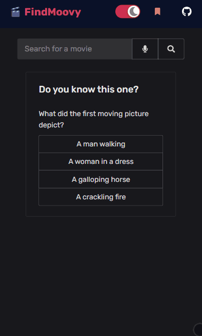

# 🎬 [FindMoovy](https://findmoovy.netlify.app/)

FindMoovy allows you search for your favourite movies, TV Shows and even Video Games, and get all sorts of accurate information on them.

> This is a pet project 🐱

## Some features ✨

- You can add/remove the movies/shows you want to watch in a watchlist without the need for creating any account.

- It can also autosuggest stuff while you type.

- It remembers what you searched for and shows them when you are about to type something!

Link for live website: [FindMoovy](https://findmoovy.netlify.app/)
